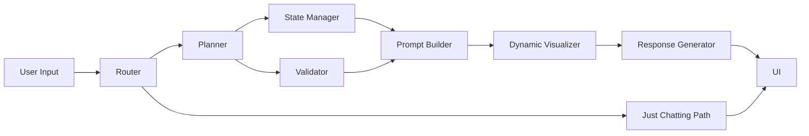
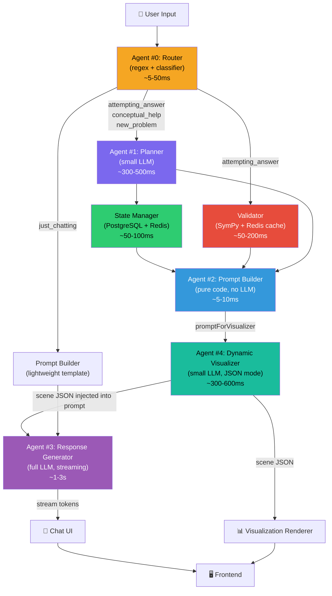

# Socratix — End-to-End Pipeline Flow (Sequential)

## High-Level Overview



---

## Detailed Sequential Flow

### Phase 0 — Input (0ms)

```
┌──────────────────────────────────┐
│           USER INPUT             │
│  "I think the answer is 9"       │
└──────────────┬───────────────────┘
               │
               ▼
```

---

### Phase 1 — Routing (~5-50ms)

> **Non-LLM.** Regex + keyword classifier with LLM fallback.

```
┌──────────────────────────────────────────────────┐
│               ROUTER (Agent #0)                  │
│                                                  │
│  1. Regex check (instant):                       │
│     /answer is|i got|i think/  → attempting_answer│
│     /help|explain|how|why/     → conceptual_help │
│     /new problem|next|another/ → new_problem     │
│                                                  │
│  2. If regex fails → lightweight LLM classifier  │
│                                                  │
│  Output:                                         │
│  {                                               │
│    intent: "attempting_answer",                   │
│    validatorRequired: true,                      │
│    plannerRequired: true                         │
│  }                                               │
└──────────────────┬───────────────────────────────┘
                   │
         ┌─────────┴──────────┐
         │                    │
    if plannerRequired    if "just_chatting"
         │                    │
         ▼                    ▼
      Phase 2            Skip to Phase 5
                         (lightweight response,
                          no planner/validator)
```

**Timing:** ~5ms (regex hit) / ~50-100ms (LLM fallback)

---

### Phase 2 — Planning + State (parallel) (~300-500ms)

> **Planner is an LLM call (small model).** State Manager is a DB call. **They run in parallel.**

```
                   Router output
                        │
           ┌────────────┴────────────┐
           ▼                         ▼
┌─────────────────────┐  ┌─────────────────────────┐
│  PLANNER (Agent #1) │  │    STATE MANAGER         │
│  (small LLM model)  │  │    (PostgreSQL)          │
│                      │  │                          │
│  Input:              │  │  Input:                  │
│  - user message      │  │  - session UID           │
│  - conversation      │  │                          │
│    history           │  │  Action:                 │
│                      │  │  - Fetch current state   │
│  Tasks:              │  │    (equation, problemType│
│  - Extract equation  │  │     step, next_state)    │
│    → "3x + 5 = 14"  │  │  - If new problem:      │
│  - Extract student   │  │    create new record     │
│    answer → 9        │  │                          │
│  - Classify type     │  │  Output:                 │
│    → "algebra"       │  │  {                       │
│  - Image analysis    │  │    uid: "abc-123",       │
│    (if applicable)   │  │    equation: "3x+5=14",  │
│                      │  │    problemType: "algebra",│
│  Output:             │  │    step: 3,              │
│  {                   │  │    history: [...]         │
│    equation: "3x+5=14│  │  }                       │
│    studentAnswer: 9, │  │                          │
│    problemType:      │  └────────────┬─────────────┘
│      "algebra",      │               │
│    extractedParams:  │               │
│      {a:3,b:5,c:14} │               │
│  }                   │               │
└──────────┬───────────┘               │
           │                           │
           └─────────┬─────────────────┘
                     │
                     ▼
                  Merge results
                     │
```

**Timing:** ~300-500ms (bounded by Planner LLM call; State Manager finishes in ~50ms, waits for Planner)

> [!TIP]
> **State Manager can start immediately** using the session UID from the Router — it doesn't need to wait for the Planner. On an existing problem session, the state is fetched before the Planner even finishes. On a new problem, it waits for the Planner's extracted equation to create the record.

---

### Phase 3 — Validation (~50-200ms)

> **Non-LLM.** SymPy / math.js computation. Runs **only if** Router flagged `validatorRequired: true`.

```
                  Merged context
                        │
                        ▼
          ┌──── validatorRequired? ────┐
          │                            │
         YES                          NO
          │                            │
          ▼                            │
┌───────────────────────┐              │
│   VALIDATOR (Backend) │              │
│                       │              │
│  1. Check Redis cache │              │
│     key: "3x+5=14:9" │              │
│     → cache miss      │              │
│                       │              │
│  2. Solve via SymPy:  │              │
│     3x + 5 = 14       │              │
│     x = 3             │              │
│                       │              │
│  3. Compare:          │              │
│     student(9) ≠ 3    │              │
│     → INCORRECT       │              │
│                       │              │
│  4. Cache result:     │              │
│     Redis SET         │              │
│     "3x+5=14:9"      │              │
│     → {correct: false,│              │
│        expected: 3}   │              │
│                       │              │
│  Output:              │              │
│  {                    │              │
│    isCorrect: false,  │              │
│    expected: 3,       │              │
│    studentAnswer: 9,  │              │
│    errorType:         │              │
│      "wrong_value"    │              │
│  }                    │              │
└──────────┬────────────┘              │
           │                           │
           └─────────┬─────────────────┘
                     │
                     ▼
```

**Timing:** ~5ms (cache hit) / ~50-200ms (cache miss, SymPy solve)

---

### Phase 4 — Prompt Assembly (~5-10ms)

> **Non-LLM.** Pure string templating in code. This is the merge point.

```
┌──────────────────────────────────────────────────────┐
│              PROMPT BUILDER (Agent #2)               │
│              (NO LLM — pure code)                    │
│                                                      │
│  Inputs:                                             │
│  ├─ intent: "attempting_answer"                      │
│  ├─ equation: "3x + 5 = 14"                         │
│  ├─ problemType: "algebra"                           │
│  ├─ studentAnswer: 9                                 │
│  ├─ validation: { correct: false, expected: 3 }      │
│  ├─ conversationHistory: [...]                       │
│  ├─ studentProfile: { level: 5, character: "triangle"│
│  └─ step: 3                                         │
│                                                      │
│  Assembles the VISUALIZER prompt first:              │
│                                                      │
│  promptForVisualizer = """
│    Generate a scene for: linear equation 3x + 5 = 14 │
│    Student error: answered 9 instead of 3            │
│    Available components: [NumberLine, Equation,       │
│      BalanceScale, StepByStep, Highlight]             │
│    Current step: substitution check                  │
│    Output JSON scene description.                    │
│  """                                                 │
│                                                      │
│  → Visualizer runs FIRST (Phase 5a)                  │
│  → Its scene JSON is injected into the response      │
│    prompt (Phase 5b) so the tutor can reference       │
│    specific visual elements accurately.              │
└──────────────────────┬───────────────────────────────┘
                       │
                       ▼
                 promptForVisualizer
                       │
```

**Timing:** ~5-10ms (string concatenation)

---

### Phase 5a — Visualization FIRST (~300-600ms)

> **LLM call (small model, JSON mode). Runs BEFORE the Response Generator.**
> During this phase, the UI shows a chain-of-thought indicator: `🎨 Preparing visualization...`

```
                 promptForVisualizer
                        │
                        ▼
          ┌────────────────────────────┐
          │  DYNAMIC VISUALIZER        │
          │  (Agent #4)                │
          │                            │
          │  Model: Gemini Flash-Lite  │
          │  Mode: JSON structured      │
          │                            │
          │  Output:                    │
          │  {                         │
          │    "scene": [              │
          │      {                     │
          │        "component":        │
          │          "BalanceScale",   │
          │        "props": {          │
          │          "left": "3(9)+5", │
          │          "leftValue": 32,  │
          │          "right": "14",    │
          │          "rightValue": 14, │
          │          "balanced": false,│
          │          "highlight":      │
          │            "imbalance"     │
          │        }                   │
          │      },                    │
          │      {                     │
          │        "component":        │
          │          "Annotation",     │
          │        "props": {          │
          │          "text": "Does this│
          │           balance?",       │
          │          "style": "hint"   │
          │        }                   │
          │      }                     │
          │    ],                      │
          │    "animation":            │
          │      "tilt_scale_left"     │
          │  }                         │
          └──────────┬─────────────────┘
                     │
                     ▼
               Scene JSON ready
               → Sent to UI (render immediately)
               → Injected into Response prompt
```

**Timing:** ~300-600ms

---

### Phase 5b — Response Generation (~1-3s)

> **LLM call (full model, streaming). Runs AFTER Visualizer completes.**
> The scene JSON is injected into the response prompt so the tutor can reference specific visual elements.
> During this phase, the UI shows: `💬 Composing response...` then streams tokens.

```
           Scene JSON from Visualizer
                     │
                     ▼
        ┌─────────────────────────────────┐
        │  PROMPT BUILDER — Part 2        │
        │  (injects scene into prompt)    │
        │                                 │
        │  promptForResponse = """        │
        │    You are a Socratic tutor.    │
        │    NEVER reveal the answer.     │
        │                                 │
        │    CONTEXT:                     │
        │    - Equation: 3x + 5 = 14      │
        │    - Student answered: x = 9    │
        │      (INCORRECT, answer is 3)   │
        │                                 │
        │    VISUALIZATION ON SCREEN:     │  ← scene context
        │    - BalanceScale showing       │
        │      left=32, right=14          │
        │      (tilting, imbalanced)      │
        │    - Annotation: "Does this     │
        │      balance?"                  │
        │                                 │
        │    STRATEGY:                    │
        │    Reference the balance scale  │
        │    the student can see. Ask     │
        │    them what 3×9+5 equals.      │
        │  """                            │
        └───────────┬─────────────────────┘
                    │
                    ▼
        ┌───────────────────────────┐
        │  RESPONSE GENERATOR       │
        │  (Agent #3)               │
        │                           │
        │  Model: Gemini 2.0 Flash  │
        │  Mode: STREAMING          │
        │                           │
        │  "Look at the balance     │
        │   scale — one side shows  │
        │   32 and the other shows  │
        │   14. Does that balance?  │
        │   Try plugging x = 9     │
        │   into 3x + 5 yourself   │
        │   and see what happens! 🤔"│
        │                           │
        │  ┌─────────────────┐      │
        │  │ Token stream:    │      │
        │  │ "Look" → UI      │      │
        │  │ " at the" → UI   │      │
        │  │ " balance" → UI  │      │
        │  │ ...              │      │
        │  └─────────────────┘      │
        │                           │
        │  ~1-3s (streaming)        │
        └──────────┬────────────────┘
                   │
                   ▼
             Streams to Chat UI
```

**Timing:** First token at ~200-400ms after visualizer completes. Full response ~1-3s.

> [!IMPORTANT]
> **Why sequential?** By running the Visualizer first, the Response Generator receives the exact scene JSON in its prompt. This means the tutor can reference specific visual elements ("look at the balance scale — it's tilting!") with guaranteed accuracy. The trade-off is ~300-600ms extra latency, which we mask with chain-of-thought indicators.

---

### Phase 6 — UI Render

```
┌────────────────────────────────────────────────────────────┐
│                         FRONTEND                           │
│                                                            │
│  Timeline (what the student sees):                         │
│                                                            │
│  0ms        User sends message                             │
│  ~50ms      💭 "Understanding your answer..."  (Phase 1)   │
│  ~400ms     🔍 "Checking your work..."         (Phase 2-3) │
│  ~660ms     🎨 "Preparing visualization..."    (Phase 5a)  │
│  ~1.2s      ┌─ Visualization renders ────────────────────┐ │
│             │  → Balance scale appears, tilting           │ │
│  ~1.4s      │  💬 "Composing response..."      (Phase 5b) │ │
│  ~1.6s      │  Response starts streaming (first token)    │ │
│  ~2.5s      │  Response still streaming...               │ │
│  ~3.5s      └─ Response complete ────────────────────────┘ │
│                                                            │
│  ┌──────────────────────────────────────────────────────┐  │
│  │  ┌─────────────────────────────────────────────────┐ │  │
│  │  │    CHAIN-OF-THOUGHT INDICATOR (top of chat)     │ │  │
│  │  │                                                 │ │  │
│  │  │    💭 Understanding your answer...              │ │  │
│  │  │    🔍 Checking your work...          ✓          │ │  │
│  │  │    🎨 Preparing visualization...     ✓          │ │  │
│  │  │    💬 Composing response...           ●●●       │ │  │
│  │  └─────────────────────────────────────────────────┘ │  │
│  │                                                      │  │
│  │  ┌─────────────────────────────────────────────────┐ │  │
│  │  │         VISUALIZATION PANEL                     │ │  │
│  │  │                                                 │ │  │
│  │  │    3(9) + 5          14                         │ │  │
│  │  │    ┌─────┐        ┌─────┐                       │ │  │
│  │  │    │ 32  │        │ 14  │                        │ │  │
│  │  │    └──┬──┘        └──┬──┘                        │ │  │
│  │  │       └──────┬───────┘                           │ │  │
│  │  │           ╱▔▔▔╲         ← tilting!               │ │  │
│  │  │          ╱     ╲                                 │ │  │
│  │  │     "Does this balance?"                         │ │  │
│  │  └─────────────────────────────────────────────────┘ │  │
│  │                                                      │  │
│  │  ┌─────────────────────────────────────────────────┐ │  │
│  │  │         CHAT PANEL                              │ │  │
│  │  │                                                 │ │  │
│  │  │  🤖 Look at the balance scale — one side        │ │  │
│  │  │     shows 32 and the other shows 14. Does       │ │  │
│  │  │     that balance? Try plugging x = 9 into       │ │  │
│  │  │     3x + 5 and see what happens! 🤔             │ │  │
│  │  │                                                 │ │  │
│  │  │  You: I think the answer is 9                   │ │  │
│  │  └─────────────────────────────────────────────────┘ │  │
│  └──────────────────────────────────────────────────────┘  │
└────────────────────────────────────────────────────────────┘
```

---

## Complete Timing Breakdown

```
Time (ms)   0    100   200   400   600   800   1000  1200  1600  2000  2500  3500
            │     │     │     │     │     │     │     │      │     │     │     │
Router      ██                                                              
            │                                                               
Planner     ·     ████████████████████                                       
State Mgr   ·     ████████                                                   
            │                    │                                           
Validator   ·                    ██████████                                   
            │                              │                                 
Prompt Bldr ·                              █                                 
            │                               │                                
Visualizer  ·                               ██████████████                    
            │                                             │                  
UI: Visual  ·                                             █ (render)         
Response Gen·                                             ████████████████████ → streaming
UI: Text    ·                                              ░░░░░░░░░░░░░░░░░░ → streaming
            │                                                                
UI: CoT     ░░░░░░░░░░░░░░░░░░░░░░░░░░░░░░░░░░░░░░░░░░░░░ (progress steps)

░ = visible to user on screen
█ = processing (backend)
· = waiting
```

| Phase | Component | Time | Cumulative | LLM? | UI Indicator |
|-------|-----------|------|------------|------|--------------|
| 1 | Router | ~5-50ms | ~50ms | No (regex) | 💭 "Understanding your answer..." |
| 2 | Planner + State Manager | ~300-500ms | ~550ms | Yes (small) + No (∥) | 🔍 "Checking your work..." |
| 3 | Validator | ~50-200ms | ~650ms | No (SymPy) | 🔍 (continued) |
| 4 | Prompt Builder | ~5-10ms | ~660ms | No (code) | — |
| 5a | Dynamic Visualizer | ~300-600ms | ~1.2s | Yes (small) | 🎨 "Preparing visualization..." |
| 5b | Response Generator | ~1-3s | ~3.5-4s | Yes (full, streaming) | 💬 "Composing response..." → tokens |
| | **Visualization appears** | | **~1.2s** | | |
| | **First text token** | | **~1.4-1.6s** | | |
| | **Full response complete** | | **~3.5-4s** | | |

---

## Flow Per Intent Type

### 🟢 "Attempting Answer" (full pipeline)
```
Router → Planner ─┐ → Validator → Prompt Builder → Visualizer → Response Gen → UI
         State Mgr┘
```

### 🔵 "Conceptual Help" (skip validator)
```
Router → Planner ─┐ → Prompt Builder → Visualizer → Response Gen → UI
         State Mgr┘
```

### 🟣 "New Problem" (create state, no validator)
```
Router → Planner → State Mgr (CREATE) → Prompt Builder → Visualizer → Response Gen → UI
```

### ⚪ "Just Chatting" (minimal pipeline)
```
Router → Prompt Builder (lightweight) → Response Gen → UI
         (no planner, no validator, no visualizer)
```

---

## Caching Strategy (Redis)

```
┌─────────────────────────────────────────────────────────────┐
│                      REDIS CACHE LAYERS                     │
│                                                             │
│  Layer 1: Router Cache                                      │
│  ┌─────────────────────────────────────────────┐            │
│  │ key: hash(input_pattern)                    │            │
│  │ val: { intent, validatorRequired }          │            │
│  │ TTL: session-scoped                         │            │
│  └─────────────────────────────────────────────┘            │
│                                                             │
│  Layer 2: Validator Cache                                   │
│  ┌─────────────────────────────────────────────┐            │
│  │ key: "equation:studentAnswer"               │            │
│  │      e.g. "3x+5=14:9"                      │            │
│  │ val: { correct: false, expected: 3 }        │            │
│  │ TTL: 24h (math doesn't change)              │            │
│  └─────────────────────────────────────────────┘            │
│                                                             │
│  Layer 3: Visualizer Scene Cache                            │
│  ┌─────────────────────────────────────────────┐            │
│  │ key: "session:problemId:baseScene"          │            │
│  │ val: { scene JSON without highlights }      │            │
│  │ TTL: session-scoped                         │            │
│  │                                             │            │
│  │ On turn 2+: LLM only generates the DIFF    │            │
│  │ (highlights, annotations), not full scene   │            │
│  └─────────────────────────────────────────────┘            │
│                                                             │
│  Layer 4: State Snapshot Cache                              │
│  ┌─────────────────────────────────────────────┐            │
│  │ key: "session:uid:state"                    │            │
│  │ val: { equation, step, problemType, history}│            │
│  │ TTL: session-scoped                         │            │
│  │                                             │            │
│  │ Avoids hitting PostgreSQL on every turn     │            │
│  └─────────────────────────────────────────────┘            │
└─────────────────────────────────────────────────────────────┘
```

### Cached Turn Performance (Turn 2+ on same problem)

```
Time (ms)   0    50   100   200   400   600   800   1000  1500  2000
            │     │     │     │     │     │     │     │     │     │
Router      █ (cache hit)                                         
Planner     · SKIP (equation already extracted)                   
State Mgr   · █ (Redis cache hit)                                 
Validator   ·  █ (Redis cache hit)                                
Prompt Bldr ·   █                                                 
Visualizer  ·    █████████ (diff only, smaller prompt)            
Response Gen·              ████████████████████████████ → streaming

First token: ~400ms ⚡
Full response: ~1.5-2s ⚡
```

---

## Data Flow Summary



---

## Chain-of-Thought UX (Progress Indicators)

Since the sequential pipeline adds ~300-600ms extra latency before the first response token, we use **chain-of-thought style progress indicators** to keep the student engaged. Each pipeline phase emits a status event via SSE, and the frontend renders it as a live progress list.

### SSE Event Format

```typescript
// Backend emits these as SSE data parts during processing
interface PipelineProgress {
  type: 'pipeline_progress';
  step: 'routing' | 'planning' | 'validating' | 'visualizing' | 'responding';
  status: 'started' | 'completed';
  label: string; // Human-readable label for the UI
}

// Example SSE stream:
data: {"type":"pipeline_progress","step":"routing","status":"started","label":"Understanding your answer..."}
data: {"type":"pipeline_progress","step":"routing","status":"completed","label":"Understanding your answer..."}
data: {"type":"pipeline_progress","step":"planning","status":"started","label":"Checking your work..."}
data: {"type":"pipeline_progress","step":"planning","status":"completed","label":"Checking your work..."}
data: {"type":"pipeline_progress","step":"visualizing","status":"started","label":"Preparing visualization..."}
data: {"type":"pipeline_progress","step":"visualizing","status":"completed","label":"Preparing visualization..."}
data: {"type":"scene_descriptor","scene":[...]}
data: {"type":"pipeline_progress","step":"responding","status":"started","label":"Composing response..."}
data: {"type":"text_delta","content":"Look "}
data: {"type":"text_delta","content":"at the "}
data: {"type":"text_delta","content":"balance scale..."}
```

### Frontend Rendering

```
┌─────────────────────────────────────────────┐
│  💭 Understanding your answer...        ✓   │
│  🔍 Checking your work...               ✓   │
│  🎨 Preparing visualization...          ✓   │
│  💬 Composing response...             ●●●   │  ← currently active
└─────────────────────────────────────────────┘
```

- Each step appears with a **spinner** while active
- Completed steps show a **✓ checkmark** and fade slightly
- The whole indicator **collapses/fades out** once the response starts streaming
- On fast cached turns, steps flash through quickly — the user just sees a brief shimmer

> [!TIP]
> This pattern is inspired by ChatGPT's "Searching the web..." / "Analyzing..." indicators. It transforms perceived wait time into transparency — the student sees the AI *thinking through their problem*, which reinforces the educational experience.
